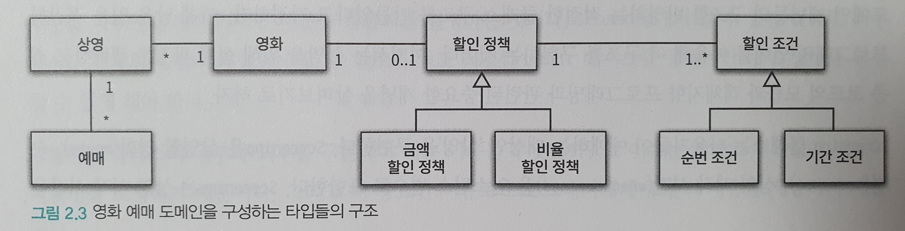
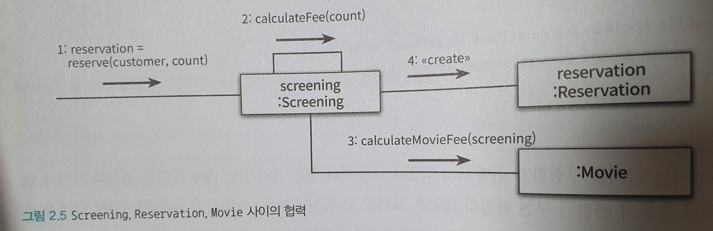
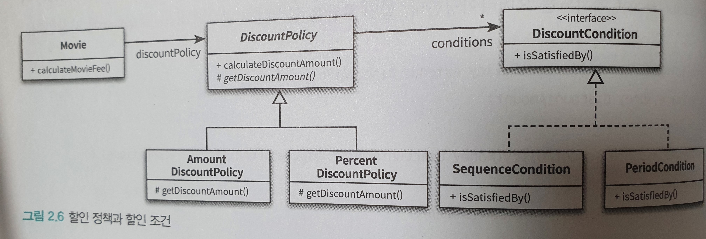

# Chapter1

## 1-1

## 1-2

Chapter 1-1에서 작성한 클래스는 '변경 용이성'과 '읽는 사람과의 의사소통'이라는 목적을 만족시키지 못한다.

### 문제점

1. 관람객과 판매원이 소극장의 통제를 받는 수동적인 존재.
2. `Audience`와 `TicketSeller`를 변경할 경우 `Theater`도 함께 변경해야 한다.
3. 변경에 취약하다.
   1. 관람객이 가방을 들고 있지 않다면?
   2. 관람객이 현금이 아니라 신용카드를 이용한다면?
   3. 판매원이 매표소 밖에서 티켓을 판매해야 한다면?

3번과 관련된 것이 바로 의존성(Dependency)이다. 바로 의존성이 변경과 관련돼 있다는 점이다. 의존성이라는 말 속에는 어떤 객체가 변경될 때 그 객체에게 의존하는 다른 객체도 함께 변경될 수 있다는 사실이 내포돼 있다.

하지만 무조건 의존성을 없애야 하는 것은 아니다. 최소한의 의존성만 유지하고 불필요한 의존성은 제거해야 한다.

객체 사이의 의존성이 과한 경우를 가리켜 결합도(Coupling)가 높다고 말한다. 결합도가 높으면 높을수록 함께 변경될 확률도 높아지기 때문에 변경하기 어려워진다. 따라서 설계의 목표는 객체 사이의 결합도를 낮춰 변경이 용이한 설계를 만드는 것이어야 한다.

## 1-3

### `TicketSeller`와 `Audience` 캡슐화

설계를 변경하기 어려운 이유는 `Theater`가 `Audience`와 `TicketSeller`뿐만 아니라 `Audience` 소유의 `Bag`과 `TicketSeller`가 근무하는 `TicketOffice`까지 마음대로 접근할 수 있기 때문이다. 해결방법은 `Audience`와 `TicketSeller`가 직접 `Bag`과 `TicketOffice`를 처리하는 자율적인 존재가 되도록 설계를 변경하는 것이다.

`TicketSeller`의 `TicketOffice`가 `private`으로 변경되어 외부에서 접근할 수 없다. 이를 캡슐화(Encapsulation)라고 한다. 캡슐화의 목적은 변경하기 쉬운 객체를 만드는 것이다. 캡슐화를 통해 객체 내부로의 접근을 제한하면 객체와 객체 사이의 결합도를 낮출 수 있기 때문에 설계를 좀 더 쉽게 변경할 수 있게 된다.

`Theater`는 오직 `TicketSeller`의 인터페이스(Interface)에만 의존한다. `TicketSeller`가 내부에 `TicketOffice` 인스턴스를 포함하고 있다는 사실은 구현(Implementation)의 영역에 속한다. 객체를 인터페이스와 구현으로 나누고 인터페이스만을 공개하는 것은 객체 사이의 결합도를 낮추고 변경하기 쉬운 코드를 작성하기 위해 따라야 하는 가장 기본적인 설계 원칙이다.

마찬가지로 `Audience`의 캡슐화를 진행해보자.

밀접하게 연관된 작업만을 수행하고 연관성 없는 작업은 다른 객체에게 위임하는 객체를 가리켜 응집도(Cohesion)가 높다고 말한다. 객체는 자신의 데이터를 스스로 처리하는 자율적인 존재여야 한다.

### 절차지향과 객체지향

`Theater`의 `enter` 메서드는 프로세스(Process)이며 `Audience`, `TicketSeller`, `Bag`, `TicketOffice`는 데이터(Data)다. 이처럼 프로세스와 데이터를 별도의 모듈에 위치시키는 방식을 절차적 프로그래밍(Procedural Programming)이라고 부른다.

프로세스와 데이터가 동일한 모듈 내부에 위치하도록 프로그래밍하는 방식을 객체지향 프로그래밍(Object-Oriented Programming)이라고 부른다.

절차지향과 객체지향의 근본적인 차이를 만드는 것은 책임의 이동(Shift of Responsibility)이다. 여기서 책임은 객체의 기능이라고 보면 된다.

절차적 프로그래밍 방식에서는 `Theater`에 책임이 집중돼 있다. 반면에 객체지향 설계에서는 책임이 각 객체에 적절하게 분산돼 있다.

### 설계의 진실

어떤 기능을 설계하는 방법은 한 가지 이상일 수 있다. 또한 동일한 기능을 한 가지 이상의 방법으로 설계할 수 있기 때문에 결국 설계는 트레이드오프의 산물이다. 어떤 경우에도 모든 사람들을 만족시킬 수 있는 설계를 만들 수는 없다.

설계는 균형의 예술이다. 훌륭한 설계는 적잘한 트레이드오프의 결과물이라는 사실을 명심하라. 이러한 트레이드오프 과정이 설계를 어려우면서도 흥미진진한 작업으로 만드는 것이다.

### 객체 설계의 의인화

`Theater`, `Bag`, `TicketOffice` 등 실세계에서는 자율적인 존재가 아닌, 무생물을 관람객이나 판매원과 같은 생물처럼 다뤘다. 무생물 역시 스스로 행동하고 자기 자신을 책임지는 자율적인 존재로 취급한 것이다.

비록 현실에서는 수동적인 존재라고 하더라도 객체지향의 세계에 들어오면 모든 것이 능동적이고 자율적인 존재로 바뀐다. 레베카 워프스브록(Rebecca Wirfs-Brock)은 이처럼 능동적이고 자율적인 존재로 소프트웨어 객체를 설계하는 원칙을 가리켜 의인화(Anthropomorphism)라고 부른다.

## 1-4

### 객체지향 설계의 중요성

좋은 설계란 오늘 요구하는 기능을 온전히 수행하면서 내일의 변경을 매끄럽게 수용할 수 있는 설계다.

변경을 수용할 수 있는 설계가 중요한 이유는 요구사항이 항상 변경되기 때문이다. 개발을 시작하는 시점에 구현에 필요한 모든 요구사항을 수집하는 것은 불가능에 가깝다. 모든 요구사항을 수집할 수 있다고 가정하더라도 개발이 진행되는 동안 요구사항은 바뀔 수밖에 없다.

그리고 변경을 수용할 수 있는 설계가 중요한 또 다른 이유는 코드를 변경할 때 버그가 추가될 가능성이 높기 때문이다. 요구사항 변경은 필연적으로 코드 수정을 초래하고, 코드 수정은 버그가 발생할 가능성을 높인다. 버그의 가장 큰 문제점은 코드를 수정하려는 의지를 꺾는 다는 것이다. 코드 수정을 회피하려는 가장 큰 원인은 두려움이다. 그리고 그 두려움은 요구사항 변경으로 인해 버그를 추가할지도 모른다는 불확실성에 기인한다.

# Chapter 2

## 2-1

### 요구사항 살펴보기

- 영화
  - 영화에 대한 기본 정보
  - 제목, 상영시간, 가격 정보 등
- 상영
  - 실제로 관객들이 영화를 관람하는 사건을 표현
  - 상영 일자, 시간, 순번 등
- 할인
  - 할인 조건
    - 순서 조건
    - 기간 조건
  - 할인 정책
    - 금액 할인 정책
    - 비율 할인 정책
    - 최대 하나의 할인 정책만 할당 가능

## 2-2

### 협력, 객체, 클래스

객체지향 프로그래밍을 하는 동안 다음의 두 가지에 집중해야 한다.

첫째, 어떤 클래스가 필요한지 고민하기 전에 어떤 객체들이 필요한지 고민하라. 클래스는 공통적인 상태와 행동을 공유하는 객체들을 추상화한 것이다. 따라서 클래스의 윤곽을 잡기 위해서는 어떤 객체들이 어떤 상태와 행동을 가지는지를 먼저 결정해야 한다. 객체를 중심에 두는 접근 방법은 설계를 단순하고 깔끔하게 만든다.

둘째, 객체를 독립적인 존재가 아니라 기능을 구현하기 위해 협력하는 공동체의 일원으로 봐야 한다. 그렇게 하면 설계를 유연하고 확장 가능하게 만든다.

### 도메인의 구조를 따르는 프로그램 구조

소프트웨어는 사용자가 원하는 어떤 문제를 해결하기 위해 만들어진다. 영화 예매 시스템의 목적은 영화를 좀 더 쉽고 빠르게 예매하려는 사용자의 문제를 해결하는 것이다. 이처럼 문제를 해결하기 위해 사용자가 프로그램을 사용하는 분야를 도메인(Domain)이라고 부른다.

### 클래스 구현하기

#### 자율적인 객체

- 객체에 대한 두 가지 중요한 사실
  1. 상태(state)와 행동(behavior)을 함께 가지는 복합적인 존재이다.
  2. 스스로 판단하고 행동하는 자율적인 존재이다.

객체지향 이전의 패러다임에서는 데이터와 기능이라는 독립적인 존재를 서로 역어 프로그램을 구성했다. 이와 달리 객체지향은 객체라는 단위 안에 데이터와 기능을 한 덩어리로 묶음으로써 문제 영역의 아이디어를 적절하게 표현할 수 있게 했다. 이처럼 데이터와 기능을 객체 내부로 함께 묶는 것을 캡슐화라고 부른다.

일반적으로 객체의 상태는 숨기고 행동만 외부에 공개해야 한다.

### 협력하는 객체들의 공동체

영화를 예매하기 위해 `Screening`, `Movie`, `Reservation` 인스턴스들은 서로의 메서드를 호출하며 상호작용한다. 이처럼 시스템의 어떤 기능을 구현하기 위해 객체들 사이에 이뤄지는 상호작용을 협력(Collaboration)이라고 부른다.

### 협력에 관한 짧은 이야기

객체는 다른 객체의 인터페이스에 공개된 행동을 수행하도록 요청(Request)할 수 있다. 요청을 받은 객체는 자율적인 방법에 따라 요청을 처리한 후 응답(Response)한다.

객체가 다른 객체와 상호작용할 수 있는 유일한 방법은 메시지를 전송(Send a message)하는 것뿐이다. 다른 객체에게 요청이 도착할 때 해당 객체가 메시지를 수신(Receive a message)했다고 이야기한다. 메시지를 수신한 객체는 스스로의 결정에 따라 자율적으로 메시지를 처리할 방법을 결정한다. 이처럼 수신된 메시지를 처리하기 위한 자신만의 방법을 메서드(Method)라고 부른다.

## 2-3

### 할인 정책과 할인 조건

## 2-4
