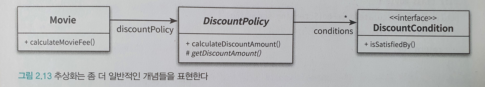
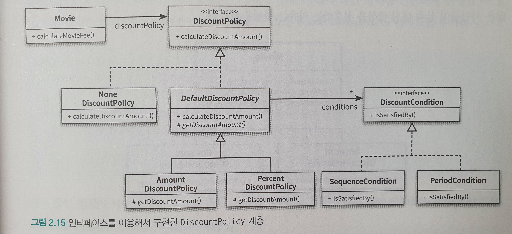

# Chapter1

## 1-1

## 1-2

Chapter 1-1에서 작성한 클래스는 '변경 용이성'과 '읽는 사람과의 의사소통'이라는 목적을 만족시키지 못한다.

### 문제점

1. 관람객과 판매원이 소극장의 통제를 받는 수동적인 존재.
2. `Audience`와 `TicketSeller`를 변경할 경우 `Theater`도 함께 변경해야 한다.
3. 변경에 취약하다.
   1. 관람객이 가방을 들고 있지 않다면?
   2. 관람객이 현금이 아니라 신용카드를 이용한다면?
   3. 판매원이 매표소 밖에서 티켓을 판매해야 한다면?

3번과 관련된 것이 바로 의존성(Dependency)이다. 바로 의존성이 변경과 관련돼 있다는 점이다. 의존성이라는 말 속에는 어떤 객체가 변경될 때 그 객체에게 의존하는 다른 객체도 함께 변경될 수 있다는 사실이 내포돼 있다.

하지만 무조건 의존성을 없애야 하는 것은 아니다. 최소한의 의존성만 유지하고 불필요한 의존성은 제거해야 한다.

객체 사이의 의존성이 과한 경우를 가리켜 결합도(Coupling)가 높다고 말한다. 결합도가 높으면 높을수록 함께 변경될 확률도 높아지기 때문에 변경하기 어려워진다. 따라서 설계의 목표는 객체 사이의 결합도를 낮춰 변경이 용이한 설계를 만드는 것이어야 한다.

## 1-3

### `TicketSeller`와 `Audience` 캡슐화

설계를 변경하기 어려운 이유는 `Theater`가 `Audience`와 `TicketSeller`뿐만 아니라 `Audience` 소유의 `Bag`과 `TicketSeller`가 근무하는 `TicketOffice`까지 마음대로 접근할 수 있기 때문이다. 해결방법은 `Audience`와 `TicketSeller`가 직접 `Bag`과 `TicketOffice`를 처리하는 자율적인 존재가 되도록 설계를 변경하는 것이다.

`TicketSeller`의 `TicketOffice`가 `private`으로 변경되어 외부에서 접근할 수 없다. 이를 캡슐화(Encapsulation)라고 한다. 캡슐화의 목적은 변경하기 쉬운 객체를 만드는 것이다. 캡슐화를 통해 객체 내부로의 접근을 제한하면 객체와 객체 사이의 결합도를 낮출 수 있기 때문에 설계를 좀 더 쉽게 변경할 수 있게 된다.

`Theater`는 오직 `TicketSeller`의 인터페이스(Interface)에만 의존한다. `TicketSeller`가 내부에 `TicketOffice` 인스턴스를 포함하고 있다는 사실은 구현(Implementation)의 영역에 속한다. 객체를 인터페이스와 구현으로 나누고 인터페이스만을 공개하는 것은 객체 사이의 결합도를 낮추고 변경하기 쉬운 코드를 작성하기 위해 따라야 하는 가장 기본적인 설계 원칙이다.

마찬가지로 `Audience`의 캡슐화를 진행해보자.

밀접하게 연관된 작업만을 수행하고 연관성 없는 작업은 다른 객체에게 위임하는 객체를 가리켜 응집도(Cohesion)가 높다고 말한다. 객체는 자신의 데이터를 스스로 처리하는 자율적인 존재여야 한다.

### 절차지향과 객체지향

`Theater`의 `enter` 메서드는 프로세스(Process)이며 `Audience`, `TicketSeller`, `Bag`, `TicketOffice`는 데이터(Data)다. 이처럼 프로세스와 데이터를 별도의 모듈에 위치시키는 방식을 절차적 프로그래밍(Procedural Programming)이라고 부른다.

프로세스와 데이터가 동일한 모듈 내부에 위치하도록 프로그래밍하는 방식을 객체지향 프로그래밍(Object-Oriented Programming)이라고 부른다.

절차지향과 객체지향의 근본적인 차이를 만드는 것은 책임의 이동(Shift of Responsibility)이다. 여기서 책임은 객체의 기능이라고 보면 된다.

절차적 프로그래밍 방식에서는 `Theater`에 책임이 집중돼 있다. 반면에 객체지향 설계에서는 책임이 각 객체에 적절하게 분산돼 있다.

### 설계의 진실

어떤 기능을 설계하는 방법은 한 가지 이상일 수 있다. 또한 동일한 기능을 한 가지 이상의 방법으로 설계할 수 있기 때문에 결국 설계는 트레이드오프의 산물이다. 어떤 경우에도 모든 사람들을 만족시킬 수 있는 설계를 만들 수는 없다.

설계는 균형의 예술이다. 훌륭한 설계는 적잘한 트레이드오프의 결과물이라는 사실을 명심하라. 이러한 트레이드오프 과정이 설계를 어려우면서도 흥미진진한 작업으로 만드는 것이다.

### 객체 설계의 의인화

`Theater`, `Bag`, `TicketOffice` 등 실세계에서는 자율적인 존재가 아닌, 무생물을 관람객이나 판매원과 같은 생물처럼 다뤘다. 무생물 역시 스스로 행동하고 자기 자신을 책임지는 자율적인 존재로 취급한 것이다.

비록 현실에서는 수동적인 존재라고 하더라도 객체지향의 세계에 들어오면 모든 것이 능동적이고 자율적인 존재로 바뀐다. 레베카 워프스브록(Rebecca Wirfs-Brock)은 이처럼 능동적이고 자율적인 존재로 소프트웨어 객체를 설계하는 원칙을 가리켜 의인화(Anthropomorphism)라고 부른다.

## 1-4

### 객체지향 설계의 중요성

좋은 설계란 오늘 요구하는 기능을 온전히 수행하면서 내일의 변경을 매끄럽게 수용할 수 있는 설계다.

변경을 수용할 수 있는 설계가 중요한 이유는 요구사항이 항상 변경되기 때문이다. 개발을 시작하는 시점에 구현에 필요한 모든 요구사항을 수집하는 것은 불가능에 가깝다. 모든 요구사항을 수집할 수 있다고 가정하더라도 개발이 진행되는 동안 요구사항은 바뀔 수밖에 없다.

그리고 변경을 수용할 수 있는 설계가 중요한 또 다른 이유는 코드를 변경할 때 버그가 추가될 가능성이 높기 때문이다. 요구사항 변경은 필연적으로 코드 수정을 초래하고, 코드 수정은 버그가 발생할 가능성을 높인다. 버그의 가장 큰 문제점은 코드를 수정하려는 의지를 꺾는 다는 것이다. 코드 수정을 회피하려는 가장 큰 원인은 두려움이다. 그리고 그 두려움은 요구사항 변경으로 인해 버그를 추가할지도 모른다는 불확실성에 기인한다.

# Chapter 2

## 2-1

### 요구사항 살펴보기

- 영화
  - 영화에 대한 기본 정보
  - 제목, 상영시간, 가격 정보 등
- 상영
  - 실제로 관객들이 영화를 관람하는 사건을 표현
  - 상영 일자, 시간, 순번 등
- 할인
  - 할인 조건
    - 순서 조건
    - 기간 조건
  - 할인 정책
    - 금액 할인 정책
    - 비율 할인 정책
    - 최대 하나의 할인 정책만 할당 가능

## 2-2

### 협력, 객체, 클래스

객체지향 프로그래밍을 하는 동안 다음의 두 가지에 집중해야 한다.

첫째, 어떤 클래스가 필요한지 고민하기 전에 어떤 객체들이 필요한지 고민하라. 클래스는 공통적인 상태와 행동을 공유하는 객체들을 추상화한 것이다. 따라서 클래스의 윤곽을 잡기 위해서는 어떤 객체들이 어떤 상태와 행동을 가지는지를 먼저 결정해야 한다. 객체를 중심에 두는 접근 방법은 설계를 단순하고 깔끔하게 만든다.

둘째, 객체를 독립적인 존재가 아니라 기능을 구현하기 위해 협력하는 공동체의 일원으로 봐야 한다. 그렇게 하면 설계를 유연하고 확장 가능하게 만든다.

### 도메인의 구조를 따르는 프로그램 구조

소프트웨어는 사용자가 원하는 어떤 문제를 해결하기 위해 만들어진다. 영화 예매 시스템의 목적은 영화를 좀 더 쉽고 빠르게 예매하려는 사용자의 문제를 해결하는 것이다. 이처럼 문제를 해결하기 위해 사용자가 프로그램을 사용하는 분야를 도메인(Domain)이라고 부른다.

### 클래스 구현하기

#### 자율적인 객체

- 객체에 대한 두 가지 중요한 사실
  1. 상태(state)와 행동(behavior)을 함께 가지는 복합적인 존재이다.
  2. 스스로 판단하고 행동하는 자율적인 존재이다.

객체지향 이전의 패러다임에서는 데이터와 기능이라는 독립적인 존재를 서로 역어 프로그램을 구성했다. 이와 달리 객체지향은 객체라는 단위 안에 데이터와 기능을 한 덩어리로 묶음으로써 문제 영역의 아이디어를 적절하게 표현할 수 있게 했다. 이처럼 데이터와 기능을 객체 내부로 함께 묶는 것을 캡슐화라고 부른다.

일반적으로 객체의 상태는 숨기고 행동만 외부에 공개해야 한다.

### 협력하는 객체들의 공동체

영화를 예매하기 위해 `Screening`, `Movie`, `Reservation` 인스턴스들은 서로의 메서드를 호출하며 상호작용한다. 이처럼 시스템의 어떤 기능을 구현하기 위해 객체들 사이에 이뤄지는 상호작용을 협력(Collaboration)이라고 부른다.

### 협력에 관한 짧은 이야기

객체는 다른 객체의 인터페이스에 공개된 행동을 수행하도록 요청(Request)할 수 있다. 요청을 받은 객체는 자율적인 방법에 따라 요청을 처리한 후 응답(Response)한다.

객체가 다른 객체와 상호작용할 수 있는 유일한 방법은 메시지를 전송(Send a message)하는 것뿐이다. 다른 객체에게 요청이 도착할 때 해당 객체가 메시지를 수신(Receive a message)했다고 이야기한다. 메시지를 수신한 객체는 스스로의 결정에 따라 자율적으로 메시지를 처리할 방법을 결정한다. 이처럼 수신된 메시지를 처리하기 위한 자신만의 방법을 메서드(Method)라고 부른다.

## 2-3

### 할인 정책과 할인 조건

## 2-4

### 상속과 인터페이스

자식 클래스는 상속을 통해 부모 클래스의 인터페이스를 물려받기 때문에 부모 클래스 대신 사용될 수 있다.
`Movie`의 생성자에서 인자의 타입이 `DiscountPolicy`임에도 `AmountDiscountPolicy`와 `PercentDiscountPolicy`의 인스턴스를 전달할 수 있는 이유가 이 때문이다.

이처럼 자식 클래스가 부모 클래스를 대신하는 것을 업캐스팅(Upcasting)이라고 부른다.

### 다형성

다시 한번 강조하지만 메시지와 메서드는 다른 개념이다. `Movie`는 `DiscountPolicy`의 인스턴스에게 `CalculateDiscountAmount` 메시지를 전송한다. 실제로 실행되는 메시지는 `Movie`와 상호작용하기 위해 연결된 객체의 클래스가 무엇인가에 따라 달라진다.

코드 상에서 `Movie` 클래스는 `DiscountPolicy` 클래스에게 메시지를 전송하지만 실행 시점에 실제로 실행되는 메서드는 `Movie`와 협력하는 객체의 실제 클래스가 무엇인지에 따라 달라진다. 다시 말해서 `Movie`는 동일한 메시지를 전송하지만 실제로 어떤 메서드가 실행될 것인지는 메시지를 수신하는 객체의 클래스가 무엇이냐에 따라 달라진다. 이를 다형성이라고 부른다.

다형성을 이용하면 메시지와 메서드를 실행 시점에 바인딩한다. 이를 지연 바인딩(Lazy binding) 또는 동적 바인딩(Dynamic binding)이라고 부른다. 그에 반해 전통적인 함수 호출처럼 컴파일 시점에 실행될 함수나 프로시저를 결정하는 것을 초기 바인딩(Early binding) 또는 정적 바인딩(Static binding)이라고 부른다.

## 2-5

### 추상화의 힘

- 추상화의 두 가지 장점
  1. 추상화의 계층만 따로 떼어 놓고 살펴보면 요구사항의 정책을 높은 수준에서 서술할 수 있다.
  2. 추상화를 이용하면 설계가 좀 더 유연해진다.

위 그림을 하나의 문장으로 정리하면 `영화 예매 요금은 최대 하나의 '할인정책'과 다수의 '할인 조건'을 이용해 계산할 수 있다.`로 표현할 수 있다.

추상화를 이용해 상위 정책을 기술한다는 것은 기본적인 애플리케이션의 협력 흐름을 기술한다는 것을 의미한다. 할인 정책이나 할인 조건의 새로운 자식 클래스들은 추상화를 이용해서 정의한 상위의 협력 흐름을 그대로 따르게 된다. 이 개념은 매우 중요한데, 재사용 가능한 설계의 기본을 이루는 디자인 패턴(Design pattern)이나 프레임워크(Framework) 모두 추상화를 이용해 상위 정책을 정의하는 객체지향의 메커니즘을 활용하고 있기 때문이다.

### 추상 클래스와 인터페이스 트레이드오프

- `DiscountPolicy` 인터페이스 추가

어떤 설계가 더 좋은가? 이상적으로는 인터페이스를 사용하도록 변경한 설계가 더 좋을 것이다. 현실적으로는 `NoneDiscountPolicy`만을 위해 인터페이스를 추가하는 것이 과하다는 생각이 들 수도 있을 것이다.

여기서 이야기하고 싶은 사실은 구현과 관련된 모든 것들이 트레이드오프의 대상이 될 수 있다는 사실이다. 여러분이 작성하는 모든 코드에는 합당한 이유가 있어야 한다. 비록 아주 사소한 결정이더라도 트레이드오프를 통해 얻어진 결론과 그렇지 않은 결론 사이의 차이는 크다. 고민하고 트레이드오프하라.

### 코드 재사용

상속은 코드를 재사용하기 위해 널리 사용되는 방법이다. 그러나 널리 사용되는 방법이라고 해서 가장 좋은 방법인 것은 아니다. 객체지향 설계와 관련된 자료를 조금이라도 본 사람들은 코드 재사용을 위해서는 상속보다는 합성(Composition)이 더 좋은 방법이라는 이야기를 많이 들었을 것이다.

### 상속

상속은 객체지향에서 코드를 재사용하기 위해 널리 사용되는 기법이다. 하지만 두 가지 관점에서 설계에 안 좋은 영향을 미친다.

1. 상속이 캡슐화를 위반한다.
2. 설계를 유연하지 못하게 만든다.
   1. 상속은 부모 클래스와 자식 클래스 사이의 관계를 컴파일 시점에 결정한다. 따라서 실행 시점에 객체의 종류를 변경하는 것이 불가능하다.

### 합성

인터페이스에 정의된 메시지를 통해서만 코드를 재사용하는 방법을 합성이라고 한다.

합성은 상속이 가지는 두 가지 문제점을 모두 해결한다. 인터페이스에 정의된 메시지를 통해서만 재사용이 가능하기 때문에 구현을 효과적으로 캡슐화할 수 있다. 또한 의존하는 인스턴스를 교체하는 것이 비교적 쉽기 때문에 설계를 유연하게 만든다. 상속은 클래스를 통해 강하게 결합되는 데 비해 합성은 메시지를 통해 느슨한게 결합된다. 따라서 코드 재사용을 위해서는 상속보다는 합성을 선호하는 것이 더 좋은 방법이다.

그렇다고 해서 상속을 절대 사용하지 말라는 것은 아니다. 대부분의 설계에서는 상속과 합성을 함께 사용해야 한다.

# Chapter 3

객체지향 패러다임의 관점에서 핵심은 역할(Role), 책임(Responsibility), 협력(Collaboration)이다.

객체지향의 본질은 협력하는 객체들의 공동체를 창조하는 것이다.

## 3-1 협력

### 영화 예매 시스템 돌아보기

객체들이 애플리케이션의 기능을 구현하기 위해 수행하는 상호작용을 협력이라고 한다. 객체가 협력에 참여하기 위해 수행하는 로직은 책임이라고 부른다. 객체들이 협력 안에서 수행하는 책임들이 모여 객체가 수행하는 역할을 구성한다.

## 3-2 책임

### 책임이란 무엇인가

객체를 설계하기 위해 필요한 문맥인 협력이 갖춰졌다고 하자. 다음으로 할 일은 협력에 필요한 행동을 수행할 수 있는 적절한 객체를 찾는 것이다. 이때 협력에 참여하기 위해 객체가 수행하는 행동을 책임이라고 부른다.

- 객체 책임의 두 가지 범주

  - 하는 것
    - 객체를 생성하거나 계산을 수행하는 등의 스스로 하는 것
    - 다른 객체의 행동을 시작시키는 것
    - 다른 객체의 활동을 제어하고 조절하는 것
  - 아는 것
    - 사적인 정보에 관해 아는 것
    - 관련된 객체에 관해 아는 것
    - 자신이 유도하거나 계산할 수 있는 것에 관해 아는 것

영화 예매 시스템을 구성하는 역할과 책임

- Screening
  - 상영 정보를 알고 있다.
  - 예매 정보를 생성한다.
- Movie
  - 영화 정보를 알고 있다.
  - 가격을 계산한다.
- DiscountPolicy
  - 할인 정책을 알고 있다.
  - 할인된 가격을 계산한다.
- DiscountCondition
  - 할인 조건을 알고 있다.
  - 할인 여부를 판단한다.

객체지향 설계에서 가장 중요한 것은 책임이다. 객체에게 얼마나 적절한 책임을 할당하느냐가 설계의 전체적인 품질을 결정한다. 객체의 구현 방법은 상대적으로 책임보다는 덜 중요하며 책임을 결정한 다음에 고민해도 늦지 않다.

### 책임 할당

자율적인 객체를 만드는 가장 기본적인 방법은 책임을 수행하는 데 필요한 정보를 가장 잘 알고 있는 전문가에게 그 책임을 할당하는 것이다. 이를 책임 할당을 위한 Information Expert(정보 전문가) 패턴이라고 부른다.

### 책임 주도 설계

협력을 설계하기 위해서는 책임에 초점을 맞춰야 한다는 것이다. 어떤 책임을 선택하느냐가 전체적인 설계의 방향과 흐름을 결정한다. 이처럼 책임을 찾고 책임을 수행할 적절한 객체를 찾아 책임을 할당하는 방식으로 협력을 설계하는 방법을 책임 주도 설계(Responsibility-Driven Design, RDD)라고 부른다.

- 시스템이 사용자에게 제공해야 하는 기능인 시스템 책임을 파악한다.
- 시스템 책임을 더 작은 책임으로 분할한다.
- 분할된 책임을 수행할 수 있는 적절한 객체 또는 역할을 찾아 책임을 할당한다.
- 객체가 책임을 수행하는 도중 다른 객체의 도움이 필요한 경우 이를 책임질 적절한 객체 또는 역할을 찾는다.
- 해당 객체 또는 역할에게 책임을 할당함으로써 두 객체가 협력하게 한다.

### 메시지가 객체를 결정한다.

객체가 메시지를 선택하는 것이 아니라 메시지가 객체를 선택하게 했다.

메시지가 객체를 선택하게 해야 하는 두 가지 중요한 이유가 있다.

1. 객체가 최소한의 인터페이스(Minimal interface)를 가질 수 있게 된다.
2. 객체는 충분히 추상적인 인터페이스(Abstract interface)를 가질 수 있게 된다.

### 행동이 상태를 결정한다.

객체지향 패러다임에 갓 입문한 사람들이 가장 쉽게 빠지는 실수는 객체의 행동이 아니라 상태에 초점을 맞추는 것이다. 초보자들은 먼저 객체에 필요한 상태가 무엇인지를 결정하고, 그 후에 상태에 필요한 행동을 결정한다. 이런 방식은 객체의 내부 구현이 객체의 퍼블릭 인터페이스에 노출되도록 만들기 때문에 캡슐화를 저해한다.

캡슐화를 위반하지 않도록 구현에 대한 결정을 뒤로 미루면서 객체의 행위를 고려하기 위해서는 항상 협력이라는 문맥 안에서 객체를 생각해야 한다.

상태는 단지 객체가 행동을 정상적으로 수행하기 위해 필요한 재료일 뿐이다. 중요한 것은 객체의 상태가 아니라 행동이다. 협력이 객체의 행동을 결정하고 행동이 상태를 결정한다. 그리고 그 행동이 바로 객체의 책임이 된다.

## 3-3 역할

### 역할과 협력

객체는 협력이라는 주어진 문맥 안에서 특정한 목적을 갖게 된다. 객체의 목적은 협력 안에서 객체가 맡게 되는 책임의 집합으로 표시된다. 이처럼 객체가 어떤 특정한 협력 안에서 수행하는 책임의 집합을 역할이라고 부른다.

### 객체 대 역할

협력에 적합한 책임을 수행하는 대상이 한 종류라면 간단하게 객체로 간주한다. 만약 여러 종류의 객체들이 참여할 수 있다면 역할이라고 부르면 된다.

# Chapter 4 설계 품질과 트레이드 오프

객체지향 설계란 올바른 객체에게 올바른 책임을 할당하면서 낮은 결합도와 높은 응집도를 가진 구조를 창조하는 활동이다.

가끔씩은 좋은 설계보다는 나쁜 설계를 살펴보는 과정에서 통찰을 얻기도 한다. 이번 장에서는 영화 예매 시스템을 책임이 아닌 상태를 표현하는 데이터 중심의 설계를 살펴보고 객체지향적으로 설계한 구조와 어떤 차이점이 있는지 살펴보겠다.

## 4-1 데이터 중심의 영화 예매 시스템

객체의 상태는 구현에 속한다. 구현은 불안정하기 때문에 변하기 쉽다. 상태를 객체 분할의 중심축으로 삼으면 구현에 관한 세부사항이 객체의 인터페이스에 스며들게 되어 캡슐화의 원칙이 무너진다. 결과적으로 상태 변경은 인터페이스의 변경을 초래하며 이 인터페이스에 의존하는 모든 객체에게 변경의 영향이 퍼지게 된다. 따라서 데이터에 초점을 맞추는 설계는 변경에 취약할 수밖에 없다.

그에 비해 객체의 책임은 인터페이스에 속한다. 객체는 책임을 드러내는 안정적인 인터페이스 뒤로 책임을 수행하는 데 필요한 상태를 캡슐화함으로써 구현 변경에 대한 파장이 외부로 퍼져나가는 것을 방지한다. 따라서 책임에 초점을 맞추면 상대적으로 변경에 안정적인 설계를 얻을 수 있게 된다.

## 4-2 설계 트레이드오프

### 캡슐화

상태와 행동을 하나의 객체 안에 모으는 이유는 객체의 내부 구현을 외부로부터 감추기 위해서다. 여기서 일어난 변경이 전체 시스템에 영향을 끼치지 않도록 파급효과를 적절하게 조절할 수 있는 장치를 제공하기 때문이다. 객체를 사용하면 변경 가능성이 높은 부분은 내부에 숨기고 외부에는 상대적으로 안정적인 부분만 공개함으로써 변경의 여파를 통제할 수 있다.

변경될 가능성이 높은 부분을 구현이라고 부르고 상대적으로 안정적인 부분을 인터페이스라고 부른다.

캡슐화는 외부에서 알 필요가 없는 부분을 감춤으로써 대상을 단순화하는 추상화의 한 종류다.

### 응집도와 결합도

응집도는 모듈에 포함된 내부 요소들이 연관돼 있는 정도를 나타낸다. 모듈 내의 요소들이 하나의 목적을 위해 긴밀하게 협력한다면 그 모듈은 높은 응집도를 가진다. 모듈 내의 요소들이 서로 다른 목적을 추구한다면 그 모듈은 낮은 응집도를 가진다. 객체지향의 관점에서 응집도는 객체 또는 클래스에 얼마나 관련 높은 책임들을 할당했는지를 나타낸다.

결합도는 의존성의 정도를 나타내며 다른 모듈에 대해 얼마나 많은 지식을 갖고 있는지를 나타내는 척도다. 어떤 모듈이 다른 모듈에 대해 너무 자세한 부분까지 알고 있다면 두 모듈은 높은 결합도를 가진다. 어떤 모듈이 다른 모듈에 대해 꼭 필요한 지식만 알고 있다면 두 모듈은 낮은 결합도를 가진다. 객체지향의 관점에서 결합도는 객체 또는 클래스가 협력에 필요한 적절한 수준의 관계만을 유지하고 있는지를 나타낸다.

일반적으로 좋은 설계란 높은 응집도와 낮은 결합도를 가진 모듈로 구성된 설계를 의미한다. 높은 응집도와 낮은 결합도를 가진 설계를 추구해야 하는 이유는 단 한가지다. 그것이 설계를 변경하기 쉽게 만들기 때문이다.

하나의 변경을 수용하기 위해 모듈 내부 전체가 함께 변경된다면 응집도가 높은 것이고 모듈의 일부만 변경된다면 응집도가 낮은 것이다. 또한 하나의 변경에 대해 하나의 모듈만 변경된다면 응집도가 높은 것이고 다수의 모듈이 함께 변경해야 한다며 응집도가 낮은 것이다.

응집도가 높을수록 변경의 대상과 범위가 명확해지기 때문에 코드를 변경하기 쉬워진다. 변경으로 인해 수정되는 부분을 파악하기 위해 코드 구석구석을 헤매고 다니거나 여러 모듈을 동시에 수정할 필요가 없으며 변경을 반영하기 위해 오직 하나의 모듈만 수정하면 된다.

## 4-3 데이터 중심의 영화 예매 시스템의 문제점

데이터 중심의 설계가 가진 대표적인 문제점을 다음과 같이 요약할 수 있다.

- 캡슐화 위반
- 높은 결합도
- 낮은 응집도

### 캡슐화 위반

캡슐화의 원칙을 어기게 된 근본적인 원인은 객체가 수행할 책임이 아니라 내부에 저장할 데이터에 초점을 맞췄기 때문이다. 객체에게 중요한 것은 책임이다.

설계할 때 협력에 관해 고민하지 않으면 캡슐화를 위반하는 과도한 접근자와 수정자를 가지게 되는 경향이 있다.객체가 사용될 문맥을 추측할 수밖에 없는 경우 개발자는 어떤 상황에서도 해당 객체가 사용될 수 있게 최대한 많은 접근자 메서드를 추가하게 되는 것이다.

### 낮은 응집도

`ReservationAgency`를 예로 들어 변경과 응집도 사이의 관계를 살펴보자. 아마 다음과 같은 수정사항이 발생하는 경우에 `ReservationAgency`의 코드를 수정해야 할 것이다.

- 할인 정책이 추가될 경우
- 할인 정책별로 할인 요금을 계산하는 방법이 변경될 경우
- 할인 조건이 추가되는 경우
- 할인 조건별로 할인 여부를 판단하는 방법이 변경될 경우
- 예매 요금을 계산하는 방법이 변경될 경우

낮은 응집도는 두 가지 측면에서 설계에 문제를 일으킨다.

- 변경의 이유가 서로 다른 코드들을 하나의 모듈 안에 뭉쳐놓았기 때문에 변경과 아무 상관이 없는 코드들이 영향을 받게 된다. 예를 들어 `ReservationAgency` 안에 할인 정책을 선택하는 코드와 할인 조건을 판단하는 코드가 함께 존재하기 때문에 새로운 할인 정책을 추가하는 작업이 할인 조건에도 영향을 미칠 수 있다. 어떤 코드를 수정한 후에 아무런 상관도 없던 코드에 문제가 발생하는 것은 모듈의 응집도가 낮을 때 발생하는 대표적인 증상이다.
- 하나의 요구사항 변경을 반영하기 위해 동시에 여러 모듈을 수정해야 한다. 응집도가 낮을 경우 다른 모듈에 위치해야 할 책임의 일부가 엉뚱한 곳에 위치하게 되기 때문이다. 새로운 할인 정책을 추가해야 한다고 가정해 보자. 이를 위해서는 `MovieType`에 새로운 할인 정책을 표현하는 열거형 값을 추가하고 `ReservationAgency`의 `reserve` 메서드의 `switch` 구문에 새로운 `case` 절을 추가해야 한다. 또한 새로운 할인 정책에 따라 할인 요금을 계산하기 위해 필요한 데이터도 `Movie`에 추가해야 한다. 하나의 요구사항 변화를 수용하기 위해 `MovieType`, `ReservationAgency`, `Movie`라는 세 개의 클래스를 함께 수정해야 하는 것이다. 새로운 할인 조건을 추가하는 경우도 마찬가지다. `DiscountConditionType`에 새로운 할인 조건 값을 추가하고 조건 판단에 필요한 새로운 데이터들을 `DiscountCondition`에 추가해야 하며, `ReservationAgency`의 할인 조건을 판단하는 `if`에 새로운 조건식을 추가해야 한다.
