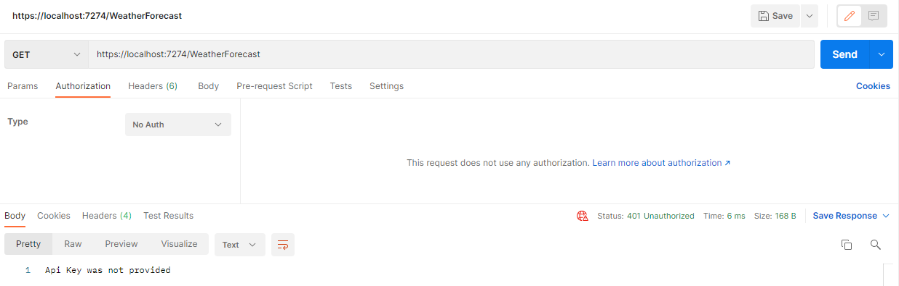
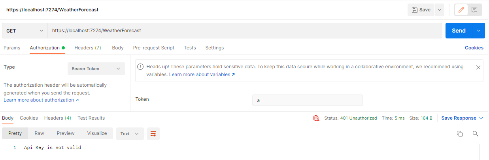
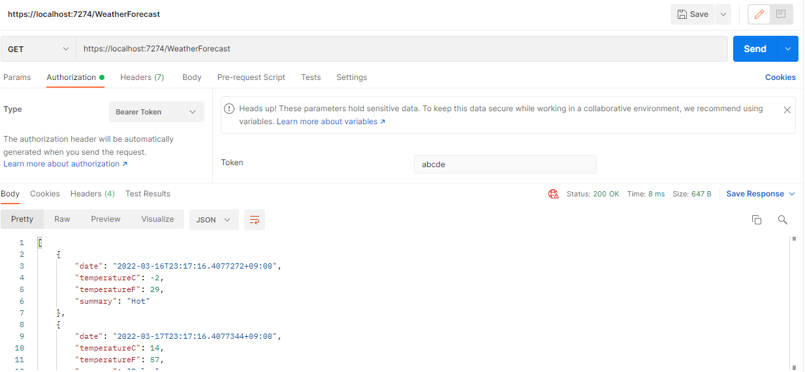
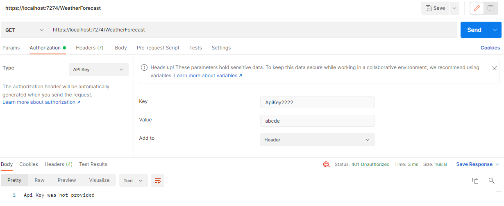
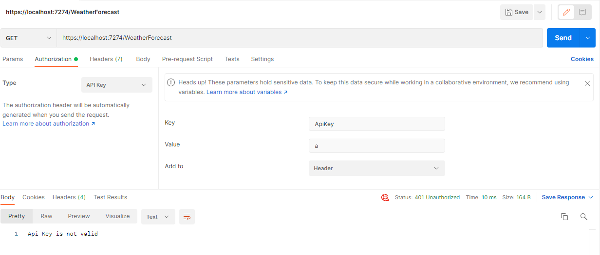
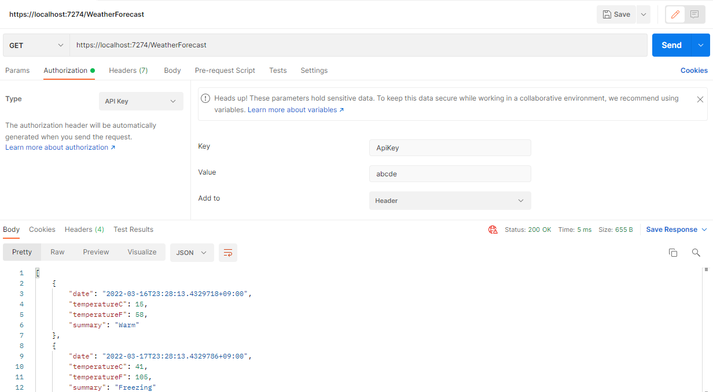

# 개요

ASP.NET Web API에서 Authentication을 구현하는 방법을 알아보자.

구현하는 방법은 여러 가지가 있지만 지금 알아볼 방법은 다음과 같다.

- Filter
- Middleware

## 테스트 환경

- .NET 6
- Visual Studio 2022
- ASP.NET WEb API Template을 이용하여 생성

# Filter

Filter Attribute를 이용하여 인증 구현하는 방법을 알아보자.

먼저 `/Attributes/ApiKeyAttribute.cs`를 생성한다.

## Filter Attribute 전체 코드

먼저 코드를 보자.

```csharp
using Microsoft.AspNetCore.Mvc;
using Microsoft.AspNetCore.Mvc.Filters;

namespace APITutorials.Attributes
{
    [AttributeUsage(AttributeTargets.Class)]
    public class ApiKeyAttribute : Attribute, IAsyncActionFilter
    {
        private const string _apiKeyName = "ApiKey";

        public async Task OnActionExecutionAsync(ActionExecutingContext context, ActionExecutionDelegate next)
        {
            var appSettings = context.HttpContext.RequestServices.GetRequiredService<IConfiguration>();

            var apiKey = appSettings.GetValue<string>(_apiKeyName);

            // 1. Header에 Authorization으로 설정한 경우
            if (string.IsNullOrEmpty(context.HttpContext.Request.Headers.Authorization))
            {
                context.Result = new ContentResult()
                {
                    StatusCode = 401,
                    Content = "Api Key was not provided"
                };
                return;
            }

            if (apiKey != context.HttpContext.Request.Headers.Authorization.ToString().Replace("Bearer ", string.Empty))
            {
                context.Result = new ContentResult()
                {
                    StatusCode = 401,
                    Content = "Api Key is not valid"
                };
                return;
            }


            // 2. 그 외 다른 이름으로 설정한 경우
            if (!context.HttpContext.Request.Headers.TryGetValue(_apiKeyName, out var extractedApiKey2))
            {
               context.Result = new ContentResult()
               {
                   StatusCode = 401,
                   Content = "Api Key was not provided"
               };
               return;
            }

            if (!apiKey.Equals(extractedApiKey2))
            {
               context.Result = new ContentResult()
               {
                   StatusCode = 401,
                   Content = "Api Key is not valid"
               };
               return;
            }

            await next();
        }
    }
}
```

## Class Signature

먼저 `Attribute`를 상속받고, `IAsyncActionFilter`를 구현해야 한다.

그리고 Attribute이기 때문에 이 Attribute를 어디에 적용시킬 지 정해야 한다. 이는 `AttributeUsage` Attribute로 지정한다.

```csharp
[AttributeUsage(AttributeTargets.Class)]
public class ApiKeyAttribute : Attribute, IAsyncActionFilter
```

## 인터페이스 구현

`OnActionExecutionAsync` 메서드를 구현하자.

파라미터로 `ActionExecutingContext`와 `ActionExecutionDelegate`를 받는다.

`ActionExecutingContext`는 요청과 어플리케이션에 관한 정보를 가지고 있으며, `ActionExecutionDelegate`는 다음 미들웨어를 호출(즉, 컨트롤러에 요청)을 하는 역할을 한다.

```csharp
public async Task OnActionExecutionAsync(ActionExecutingContext context, ActionExecutionDelegate next)
```

## Configuration에서 api key 정보 가져오기

configuration 정보를 가져오는 여러 방법 중 다음 방법을 이용하였다.

```csharp
var appSettings = context.HttpContext.RequestServices.GetRequiredService<IConfiguration>();

var apiKey = appSettings.GetValue<string>(_apiKeyName);
```

해당 설정은 `/appsettings.json`에서 할 수 있다.

api key를 설정하자. (테스트용이라 api key를 굉장히 심플하게 설정하였지만 실제로는 굉장히 복잡한 문자열을 만들어야 한다.)

```json
{
  "Logging": {
    "LogLevel": {
      "Default": "Information",
      "Microsoft.AspNetCore": "Warning"
    }
  },
  "AllowedHosts": "*",
  "ApiKey": "abcde"
}
```

## 인증 로직 #1

자 준비는 끝났다. 인증 로직을 살펴보자.

예제에는 두 가지 인증 로직이 존재하는 데, 둘 다 쓰는 것이 아니라 둘 중에 마음에 드는 것으로 선택하여 하나만 쓰도록.

그 중 첫 번째.

HTTP Header 중 Authorization을 이용하는 방법.

```csharp
// HTTP Header에 Authorization이 설정되었는 지 확인
if (string.IsNullOrEmpty(context.HttpContext.Request.Headers.Authorization))
{
    context.Result = new ContentResult()
    {
        StatusCode = 401,
        Content = "Api Key was not provided"
    };
    return;
}

// Authorization에 설정된 값이 실제 api key와 일치하는 지 확인
if (apiKey != context.HttpContext.Request.Headers.Authorization.ToString().Replace("Bearer ", string.Empty))
{
    context.Result = new ContentResult()
    {
        StatusCode = 401,
        Content = "Api Key is not valid"
    };
    return;
}
```

인증 로직은 사실 심플하다. 키가 있는 지 확인하고, 키가 일치하는 지 확인한다.

키가 존재하지 않거나, 일치하지 않으면 `ContentResult`를 이용하여 Response StatusCode와 메시지를 설정하여 해당 요청을 종료한다.

### POSTMAN으로 테스트

POSTMAN으로 테스트한 결과는 다음과 같다.

- Authorization 설정하지 않은 경우



- Authorization 설정하였지만 키가 일치하지 않는 경우



- Authorization 설정하고, 키가 일치한 경우



## 인증 로직 #2

두 번째 인증 로직.

단순히 HTTP Header에 커스텀한 필드를 설정하는 것이다.

(사실 이는 HTTP 표준에 맞지 않으므로 Authorization을 이용한 방법을 사용하도록 하자)

```csharp
if (!context.HttpContext.Request.Headers.TryGetValue(_apiKeyName, out var extractedApiKey2))
{
    context.Result = new ContentResult()
    {
        StatusCode = 401,
        Content = "Api Key was not provided"
    };
    return;
}

if (!apiKey.Equals(extractedApiKey2))
{
    context.Result = new ContentResult()
    {
        StatusCode = 401,
        Content = "Api Key is not valid"
    };
    return;
}
```

api key name으로 설정한 값(`_apiKeyName="ApiKey"`)이 HTTP Header에 존재 하지 않거나, 키가 일치하지 않으면 해당 요청은 종료된다.

### POSTMAN으로 테스트

POSTMAN으로 테스트한 결과는 다음과 같다.

- HTTP Header api key 필드를 설정하지 않거나, api key name이 틀린 경우



- Authorization 설정하였지만 키가 일치하지 않는 경우



- Authorization 설정하고, 키가 일치한 경우



## 인증이 완료됐다면 컨트롤러로 요청을 넘겨주자

```csharp
await next();
```

컨트롤러로 요청을 넘겨주는 방법은 정말 심플 그 자체.

그저 다음 미들웨어로 넘기면 된다.
