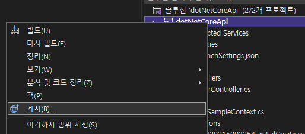
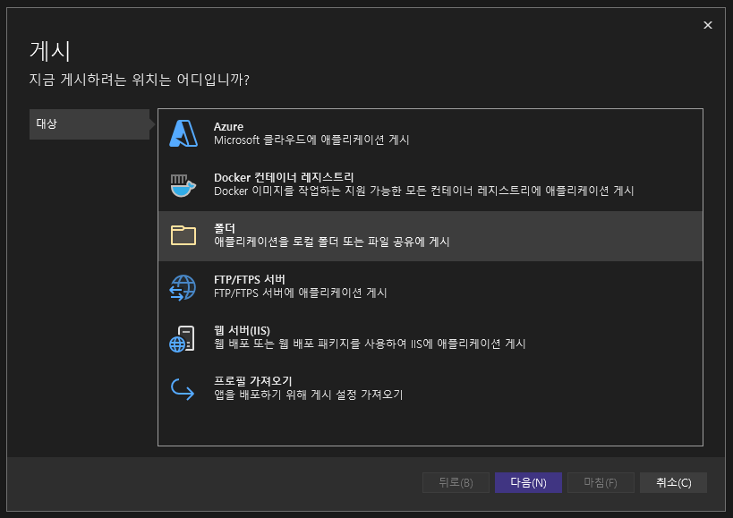
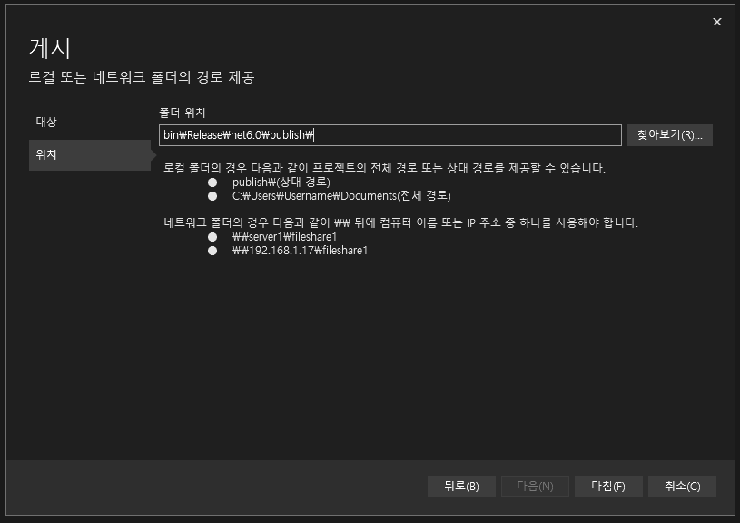
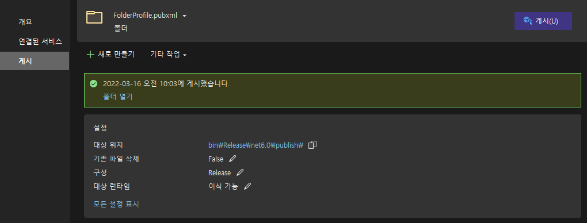

# ASP.NET Core IIS에 배포하기

## 개발 환경

- .NET 6
- Visual Studio 2022

## 사전 준비

배포 대상이 되는 서버에 ASP.NET Core 호스트 번들이 설치되어 있어야 한다.

설치 파일 다운로드 경로는 추후 변경될 수 있으니 공식 홈페이지에서 찾도록 하자.

ASP.NET Core 호스트 번들 설치가 완료되었으면 IIS를 다시 시작해야 한다.

명령 프롬프트 혹은 터미널에서 다음 커맨드를 순차적으로 실행

```bash
net stop was /y # iis 중지

net start w3svc # iis 실행
```

## 웹앱 게시

1. Visual Studio에서 배포하려는 프로젝트를 마우스 오른쪽 클릭 후 게시를 선택
2. 폴더 게시 선택
3. 원하는 경로 혹은 기본 경로로 마침
4. 게시 탭에서 우측 상단의 게시 버튼 클릭
5. 게시로 생성된 전체 파일을 IIS의 알맞은 경로에 복사









## References

[Microsfot Docs](https://docs.microsoft.com/ko-kr/aspnet/core/tutorials/publish-to-iis?view=aspnetcore-6.0&tabs=visual-studio)
