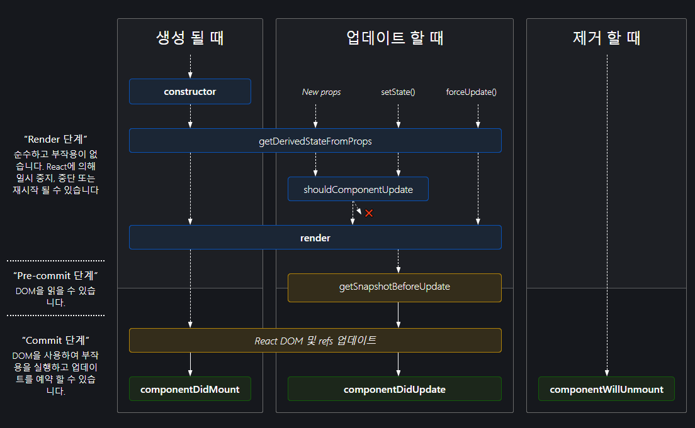

# Component Life Cycle

리액트 컴포넌트를 정의할 때 클래스 컴포넌트를 이용해야 더 많은 기능을 제공받을 수 있다.

클래스 컴포넌트는 `React.Component`를 상속받아야 한다.

## 생명주기 다이어그램



출처: https://projects.wojtekmaj.pl/react-lifecycle-methods-diagram/

## 생명주기와 관련된 메서드

자주 사용되는 메서드는 **bold** 처리하였다.

### 마운트 (생성)

- **생성자**
- static getDerivedStateFromProps
- **render**
- **componentDidMount**

### 업데이트

- static getDerivedStateFromProps
- shouldComponentUpdate
- **render**
- getSnapshotBeforeUpdate
- **componentDidUpdate**

### 마운트 해제 (제거)

- **componentWillUnmount**

## 마운트 메서드

### render

```js
render();
```

- `render`의 반환형
  - 리액트 엘리먼트
  - 배열과 Fragment
  - Portal
  - 문자열과 숫자
  - Boolean 또는 null

`render` 메서드는 클래스 컴포넌트에서 반드시 구현돼야하는 유일한 메서드이다.

`render` 함수는 순수해야 한다.

즉, 컴포넌트의 state를 변경하지 않고, 호출될 때마다 동일한 결과를 반환해야 하며, 브라우저와 직접적으로 상호작용을 하지 않는다.

### 생성자

```js
constructor(props);
```

메서드를 바인딩하거나 state를 초기화하는 작업이 없다면, 생성자를 구현하지 않아도 된다.

직접 구현을 한다면, `super(props)`를 다른 구문에 앞서 호출해야 한다. 그렇지 않으면, `this.props`가 생성자 내에서 정의되지 않아 버그로 이어질 수 있다.

생성자 내부에서 `setState`를 호출하면 안된다. 컴포넌트에 지역 state가 필요하다면 생성자 내에서 `this.state`에 초기 state 값을 할당하면 된다.

생성자 내에서는 부수 효과를 발생시키거나 구독 작업을 수행하면 안된다.

state에 props를 복사하면 안된다. props 값이 필요하다면 `this.props`로 접근하여 사용하면 된다.

```js
constructor(props) {
  super(props);
  // 여기서 this.setState()를 호출하면 안 됩니다!
  this.state = { counter: 0 };
  this.handleClick = this.handleClick.bind(this);
  // 이렇게 하지 마세요!
  this.state = { color: props.color };
}
```

생성자는 보통 다음 두 가지 목적을 위하여 사용

- `this.state`에 객체를 할당
- 이벤트 처리 메서드 바인딩

### componentDidMount

```js
componentDidMount();
```

컴포넌트가 마운트된 직후 호출된다.

DOM 노드가 있어야 하는 초기화 작업은 이 메서드에서 이루어지면 된다.

외부에서 데이터를 불러와야 한다면, 네트워크 요청을 보내기 적절한 위치이다.

데이터 구독을 설정하기 좋은 위치이다. 데이터 구독이 이루어졌다면, `componentWillUnmount`에서 구독 해제 작업을 반드시 수행해야 한다.

`setState` 메서드를 호출하는 경우, 추가적인 렌더링이 발생하지만 브라우저가 화면을 갱신하기 전에 이루어질 것이다. `render` 메서드가 두 번 호출되지만, 사용자는 그 과정을 볼 수 없다. 모달 또는 툴팁 등과 같이 렌더링에 앞서 DOM 노드의 크기나 위치를 먼저 측정해야 하는 경우가 아니라면 state 할당은 생성자에서 하도록 하자.

## 업데이트 메서드

### componentDidUpdate

```js
componentDidUpdate(prevProps, prevState, snapshot);
```

갱신이 일어난 직후 호출된다. 최초 렌더링에서는 호출되지 않는다.

이전과 현재의 props를 비교하여 네트워크 요청을 보내는 작업도 이 메서드에서 이루어지면 된다.

```js
componentDidUpdate(prevProps) {
  // 전형적인 사용 사례 (props 비교를 잊지 마세요)
  if (this.props.userID !== prevProps.userID) {
    this.fetchData(this.props.userID);
  }
}
```

`setState` 메서드를 호출하는 경우, 조건문으로 적절히 분기하지 않으면 무한 반복이 발생할 수 있으니 주의하자. 또한 추가적인 렌더링을 유발하여 성능에 영향을 미칠 수 있다.

`getSnapshotBeforeUpdate` 메서드를 구현하면, 해당 메서드가 반환하는 값은 세 번째 파라미터인 `snapshot` 인자로 넘겨진다. 반환값이 없다면 해당 인자는 `undefined`를 가진다.

## 마운트 해제 메서드

### componentWillUnmount

```js
componentWillUnmount();
```

마운트 해제되어 제거되기 직전에 호출된다.

타이머 제거, 네트워크 요청 취소, 구독 해제 등 필요한 모든 정리 작업을 수행해야 한다.

이후 해당 컴포넌트는 다시 렌더링되지 않으므로, `setState` 메서드를 호출하면 안된다.
