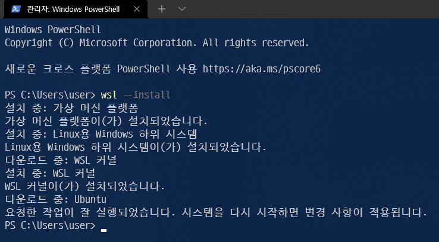
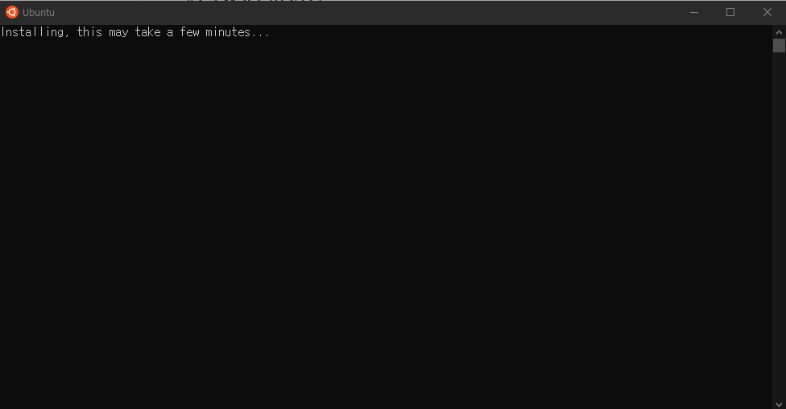
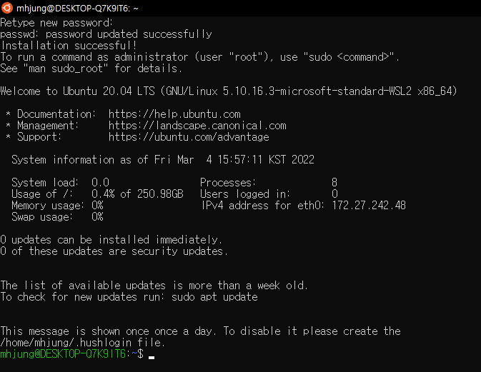
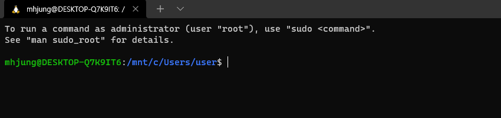
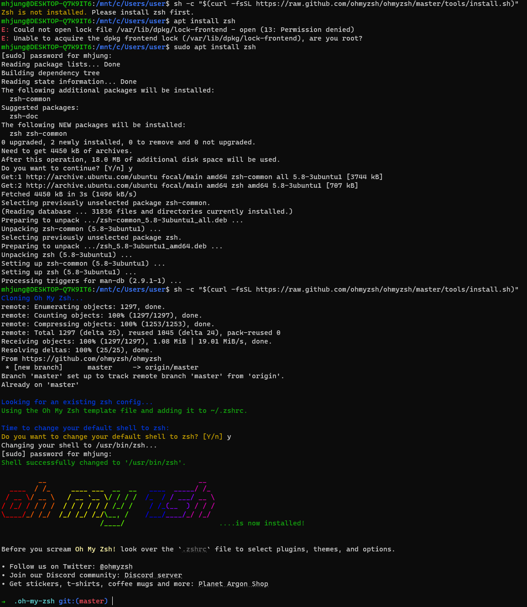

# WSL 설치

## WSL 설치

1, 2년 전에 WSL 설치할 때보다 훨씬 간편해졌다.

먼저 `윈도우 터미널`을 관리자 권한으로 실행해준다. (윈도우 터미널은 wsl을 이용할 때 필요하니 미리 설치하도록 하자)

다른 설정을 하지 않았다면 powershell로 실행될 것이다.

다음 명령어를 실행

```powershell
wsl --install
```

설치가 완료되면 다음과 같이 보일 것이다.



> 기본적으로 WSL2, Ubuntu가 설치된다.
>
> 다른 버전을 설치하고 싶다면 옵션이 존재하니 공식문서에서 찾아보자.

## 우분투 설치

컴퓨터를 재시작하면 자동으로 우분투 설치가 시작된다.



우분투 설치가 완료되면 계정 설정을 해야 한다.

원하는 계정과 비밀번호 입력하고 완료하면 우분투 설치 완료!



윈도우 터미널로 우분투를 실행할 수 있다.



## 우분투 zsh & Oh My Zsh 설치

Oh My Zsh 깃헙 : https://github.com/ohmyzsh/ohmyzsh

해당 깃헙에 접속하면 zsh, ohmyzsh 설치 방법이 모두 나와 있다.

ohmyzsh를 설치하려면 먼저 zsh가 설치되어 있어야 한다.

또한 zsh를 설치할 때는 루트권한이 필요하니 `sudo`를 이용하자.

설치가 완료되면 모습이 변한 것을 볼 수 있다.



## zsh 예쁘게 꾸미기

터미널 꾸미는 방법이 여러가지가 있지만 `Oh My Posh`를 사용하겠다.

Oh My Posh 홈페이지: https://ohmyposh.dev/

윈도우, 맥, 리눅스 모두 사용 가능!!!

### 리눅스에 설치

다음의 명령어를 순차적으로 입력

만약 `homebrew`가 설치되어 있지 않으면 먼저 `homebrew`를 설치

```zsh
/bin/bash -c "$(curl -fsSL https://raw.githubusercontent.com/Homebrew/install/HEAD/install.sh)"

echo 'eval "$(/home/linuxbrew/.linuxbrew/bin/brew shellenv)"' >> ~/.zprofile

eval "$(/home/linuxbrew/.linuxbrew/bin/brew shellenv)"

echo "eval \"\$($(brew --prefix)/bin/brew shellenv)\"" >> ~/.profile
```

```zsh
brew tap jandedobbeleer/oh-my-posh

brew install oh-my-posh

echo 'eval "$(oh-my-posh --init --shell zsh --config https://raw.githubusercontent.com/JanDeDobbeleer/oh-my-posh/v$(oh-my-posh --version)/themes/jandedobbeleer.omp.json)"' >> ~/.zprofile

source ~/.zshrc
```

테마 변경은 `~/.zprofile` 파일에서 `oh-my-posh`의 테마관련 json을 변경해주면 된다.

## Visual Studio Code

VSCode에서 WSL을 사용하고 싶다면 `Remote - WSL` 익스텐션을 설치하도록 하자.
